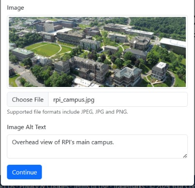

# Soundscape Authoring Tool User Guide
Soundscape Authoring Tool is a web app which allows users to create routed activities for use with the Soundscape iOS app.

## Table of Contents
1. [Logging In](#logging-in)
2. [User Registration](#user-registration)
3. [User Page](#user-page)
4. [Creating a new Activity](#creating-a-new-activity)
5. [Adding Waypoints to new Activity](#adding-waypoints-to-new-activity)
6. [Adding information to Waypoints](#adding-information-to-waypoints)
7. [Adding Points of Interest to new Activity](#adding-points-of-interest-to-new-activity)
8. [Adding Information to Points of Interest](#adding-information-to-points-of-interest)
9. [Finishing up an Activity](#finishing-up-an-activity)
10. [Publishing an Activity](#publishing-an-activity)
11. [Importing and Exporting Activities](#importing-and-exporting-activities)

## Logging In

This is the user login page! Enter your user credentials to access the user page. *Contact system administrator for forgotten password!*

## User Registration
To access the user registration page, click on "Sign up!" on the login page. You will be greeted with the registration form.

+ **Usernames must:** have *at least* 5 characters and *cannot* contain whitespace or non-alpanumeric characters!
+ **Emails must:** be a valid email address, as well as be a email that is whitelisted in our database. *Contact system administrator if your email is not whitelisted!*
+ **Passwords must** be *at least* 8 characters long, contain *a number, uppercase letter, lowercase letter,  **AND** one special character.*

## User Page

This is the user page! On the top right corner you should be able to see the user you are signed in as, as well as the email associated with that user. You can also click the dropdown in the top right to sign out and switch users if needed!

### Creating a new Activity
To create a new activity, you can click the "+ Create" button found on the user page. You will then be prompted with a window to enter in data for the new activity.

Here you can add information about your new activity.
Add a name and proper description for your activity, as well as the author/organization in charge of this activity. *These fields are required!*

An image can also be added to the activity to give more insight as to what the activity is about. A alternative description should also be added in the case that the image cannot be viewed.

**Click "continue" to finish the creation of your new Activity**

### Adding Waypoints to new Activity
Once a new activity is created, you will be greeted with a new page where you can add waypoints for your new activity.

Waypoints are points that will guide your user through your activity.
There are two ways to add a waypoint to your activity.

**Method 1: Using the Map**
The quickest way to add a new waypoint is by clicking anywhere on the map where you would like a waypoint to exist in your activity. This eliminates the need to worry about the coordinates of your waypoint.

*Important note: Make sure that the mode is set to "waypoint" mode on the bottom left of the map!*

You can then add more data to your waypoint by scrolling down to your waypoint on the left column of the page and clicking the edit button.

**Method 2: Manual Waypoint**
The second way to add a new waypoint is by scrolling down to the waypoint section in the left column of the page and clicking the "+ Add" button.

### Adding information to Waypoints
Once a waypoint is created, information must be added to it. This can be done by clicking the edit button on a waypoint, or my clicking the "+ Add" button in the waypoint section.

The edit waypoint screen will allow you to add more information, or edit an existing waypoint.
In general, it is best to give an accurate name to a waypoint.

**Departure and Arrival callouts** help make the activity more engaging and personalized. They allow the author/organization of the activity to add their own custom audio description of a waypoint. This custom callout will be announced when the user either places a beacon on the waypoint, or arrives to the waypoint.

For example, let's say you are creating a guided tour for the Rensselaer Polytechnic Institute campus in Troy, NY. To improve the user's experience during the guided tour, we can make the arrival callout be some historical information about buildings located at each waypoint. 

*In this case, a possible arrival callout can be "On your left is the George M. Low Center for Industrial Innovation. The center is named after George M. Low, who was an administrator at NASA and President of the institute...", or something along those lines.*

### Adding Points of Interest to new Activity
**Points of Interest** can be used to mark notable points within the activity that are not on the path of your activity. Points of interest do not have custom departure and arrival callouts. The app will refer to the point of interest using its name during callouts.

An author/organization can add a point of interest in two ways.

**Method 1: Using the Map**
The quickest way to add a new point of interest is by clicking anywhere on the map where you would like a point of interest to exist in your activity. This eliminates the need to worry about the coordinates of your point of interest.
*Important note: Make sure that the mode is set to "Points of Interest" mode on the bottom left of the map!*

You can then add more data to your point of interest by scrolling down to your point of interest on the left column of the page and clicking the edit button.

**Method 2: Manual Point of Interest**
The second way to add a new point of interest is by scrolling down to the "Points of Interest" section in the left column of the page and clicking the "+ Add" button.

### Adding Information to Points of Interest
Once a point of interest is created, information can be added to it or edited. This can be done by clicking the edit button on a point of interest, or my clicking the "+ Add" button in the "Points of Interest" section.

### Finishing up an Activity
Once an author is finished adding waypoints and points of interest to their activity, they can click the green "Finish" button on the top right of the page. This will save all changes made to the activity.

## Publishing an Activity
Once an author is done with creating their activity, they can publish the activity by clicking the "Publish" button on the top right of the page. 

Publishing an activity creates or updates the link that can be used with the "Your App" app to start the activity. 

After publishing, the "Link" button on the top right of the page can be clicked to share or start the activity. ***Note that it is currently not possible to un-publish a published activity!***

## Importing and Exporting Activities
Soundscape Authoring Tool supports importing and exporting activities to enable easy sharing of activities between users. Simply click the "Export" button on the top right of an Activity page to export the current Activity as a GPX file.

Importing is just as easy. To import an existing Activity, click on the "Import" button on the "My Activities" page. 

***Note: Imported Activites must be in the form of a GPX file.***